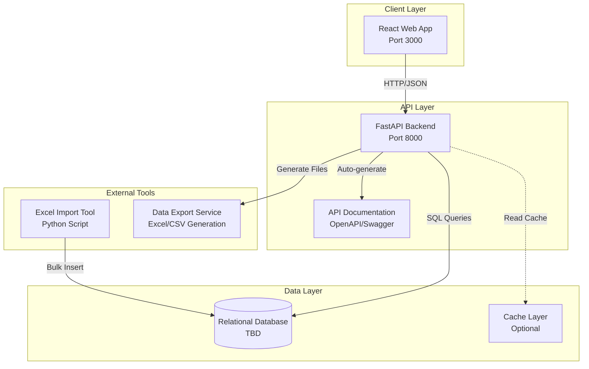
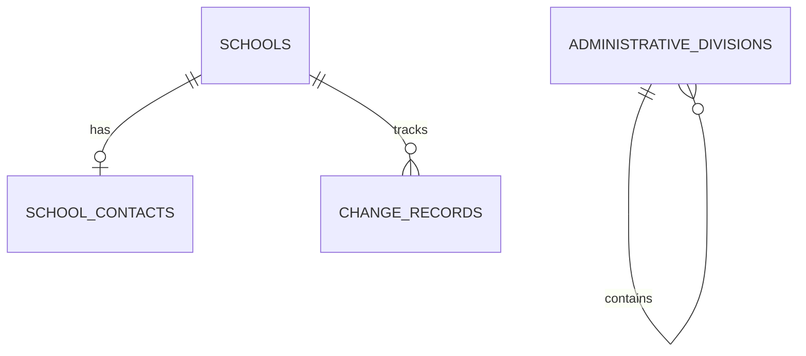

# Architecture

## 1. System Context (C4 Level 1)

```
┌─────────────────────────────────────────────────────────────┐
│                School Directory System                      │
│                                                             │
│  ┌─────────────────┐    ┌─────────────────┐                │
│  │ Regional Admin  │    │ Data Analyst    │                │
│  │                 │    │                 │                │
│  └─────────────────┘    └─────────────────┘                │
│           │                       │                        │
│           └───────────┬───────────┘                        │
│                       │                                    │
│           ┌───────────▼───────────┐                        │
│           │                       │                        │
│           │   Web Application     │                        │
│           │   (React Frontend)    │                        │
│           │                       │                        │
│           └───────────┬───────────┘                        │
│                       │                                    │
│           ┌───────────▼───────────┐                        │
│           │                       │                        │
│           │   REST API            │                        │
│           │   (FastAPI Backend)   │                        │
│           │                       │                        │
│           └───────────┬───────────┘                        │
│                       │                                    │
│           ┌───────────▼───────────┐                        │
│           │                       │                        │
│           │   Relational          │                        │
│           │   Database            │                        │
│           │                       │                        │
│           └───────────────────────┘                        │
│                                                             │
└─────────────────────────────────────────────────────────────┘

External Systems (Future):
┌─────────────────┐    ┌─────────────────┐
│ Excel Import    │    │ External APIs   │
│ Tool            │    │ (School Data)   │
└─────────────────┘    └─────────────────┘
```

**Actors:**
- **Regional Admin**: Browse and filter schools by administrative regions
- **Data Analyst**: Search, export, and analyze school data for reporting
- **Ministry Official**: Access nationwide school data for policy and communication

**System Purpose:**
- Provide fast, reliable access to school directory information
- Support hierarchical filtering by voivodeship → region → city
- Enable data export for offline analysis and reporting

## 2. Container Architecture (C4 Level 2)



**Container Responsibilities:**
- **React Web App**: User interface for browsing, searching, and filtering schools
- **FastAPI Backend**: REST API with business logic, validation, and data access
- **Relational Database**: Persistent storage with ACID compliance and complex queries
- **Cache Layer**: Optional performance optimization for frequently accessed data
- **Excel Import Tool**: Batch processing for loading school data from spreadsheets
- **Data Export Service**: Generate Excel/CSV files for offline analysis

## 3. Component Architecture (C4 Level 3)

### Backend Components

```
├── API Layer
│   ├── Schools API       # CRUD operations for school records
│   ├── Search API        # Full-text search and filtering
│   ├── Regions API       # Administrative hierarchy endpoints
│   └── Export API        # Data export functionality
│
├── Service Layer
│   ├── School Service    # Business logic for school operations
│   ├── Search Service    # Search and filtering logic
│   ├── Export Service    # File generation and formatting
│   └── Import Service    # Data validation and bulk operations
│
├── Data Access Layer
│   ├── School Repository # Database operations for schools
│   ├── Contact Repository# Contact information management
│   └── Audit Repository  # Change tracking and provenance
│
└── Infrastructure
    ├── Database Config   # Connection management and sessions
    ├── Cache Manager     # Optional caching strategy
    └── File Handler      # Excel/CSV processing utilities
```

### Frontend Components

```
├── Page Layer
│   ├── School List Page  # Main browsing interface
│   ├── School Detail Page# Individual school information
│   └── Export Page       # Data export interface
│
├── Component Layer
│   ├── Search & Filters  # Interactive filtering controls
│   ├── Data Table        # Sortable, paginated school list
│   ├── School Card       # Individual school display
│   └── Export Controls   # File generation interface
│
└── Service Layer
    ├── API Client        # HTTP communication with backend
    ├── State Management   # Application state and caching
    └── Utilities          # Formatting and validation helpers
```

## 4. Database Architecture (ERD)



**Entity Relationships:**
- **Schools**: Core entity with basic information and embedded contact fields (Iteration 1)
- **School Contacts**: Detailed contact information with per-field provenance (Iteration 2)
- **Change Records**: Audit trail for all modifications (Iteration 2)
- **Administrative Divisions**: Polish territorial hierarchy for consistent filtering

## 5. Technology Stack

| Layer | Technology | Justification |
|-------|------------|---------------|
| **Frontend** | React + TypeScript | Interactive UI, type safety, component reusability |
| **Backend** | FastAPI + Python | Rapid development, automatic OpenAPI documentation |
| **Database** | Relational DB (TBD) | ACID compliance, complex queries, full-text search |
| **API Documentation** | OpenAPI 3.0 | Auto-generated, interactive documentation |
| **Caching** | Cache Layer (Optional) | Performance optimization for read-heavy workloads |
| **Search** | Database Native | Built-in full-text search, no external dependencies |
| **Data Processing** | Python + Pandas | Excel processing, data validation, bulk operations |
| **Deployment** | Containerized | Platform independence, easy scaling |

**Technology Decision Criteria:**
- **Performance**: Sub-300ms response time for 100k+ records
- **Maintainability**: Clear separation of concerns, testable components
- **Scalability**: Support for growing dataset and concurrent users
- **Developer Experience**: Fast iteration, clear debugging, comprehensive documentation

## 6. Data Flow

### Iteration 1: Read-Only Operations
```
Excel Files → Import Script → Database → FastAPI → React
                                    ↓
                            Performance Indexes
                                    ↓
                            Search/Filter/Sort
                                    ↓
                            Export to Excel/CSV
```

### Iteration 2: Read-Write Operations (Future)
```
User Input → React → FastAPI → Business Logic → Database
                                      ↓
                           Change Records (Audit)
                                      ↓
                           Contact Provenance Tracking
                                      ↓
                           External API Integration
```

## 7. Performance Strategy

### Database Optimization
- Strategic indexing for geographic hierarchy (voivodeship, region, city)
- Full-text search indexes for school names and addresses
- Connection pooling for concurrent access
- Query optimization for common filtering patterns

### API Performance
- Pagination for large result sets (default 20, max 100 items)
- Response caching for static/semi-static data
- Async/await for concurrent database operations
- Request validation and early error responses

### Scalability Considerations
- Horizontal scaling through stateless API design
- Database read replicas for read-heavy workloads
- CDN for static assets and API documentation
- Background job processing for heavy operations (large exports, imports)
